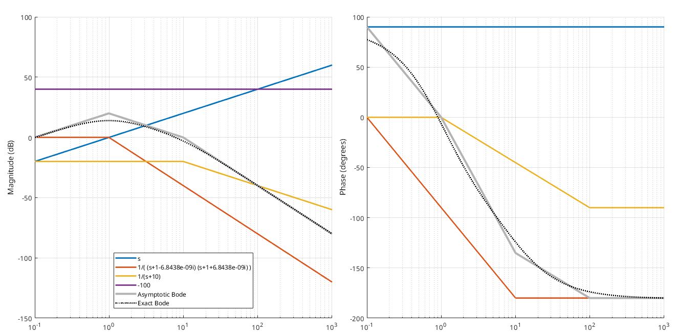

# bodas
The asymptotic bode diagram in MATLAB

## Ex.1 with real poles/zeros

```
s = tf('s');
G = -100*s / (s^3 + 12*s^2 + 21*s + 10)
[G, w] = bodas(G);
```

[G, w] = bodas(G);



## Ex2. with complex conjugate poles/zeros

```
s = tf('s');
G = (-s^2-0.2*s-4.01) / s
[G, w] = bodas(G);
```


## How to use

Please read: bodas-manual.pdf

## References

[MIT OCW -- Dynamics and Control II -- Lecture 33](https://ocw.mit.edu/courses/2-004-dynamics-and-control-ii-spring-2008/f8706caa7aecebcc533553fb154778d0_lecture_33.pdf)  
https://lpsa.swarthmore.edu/Bode/BodeHow.html
